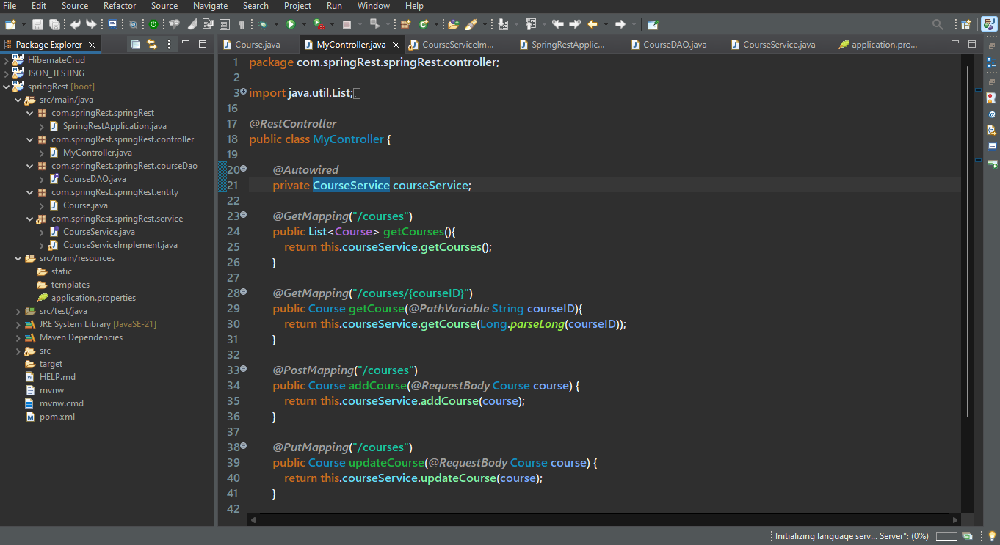
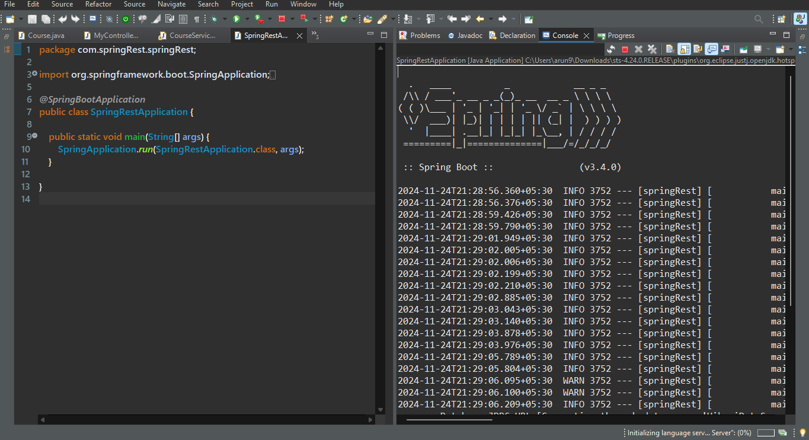
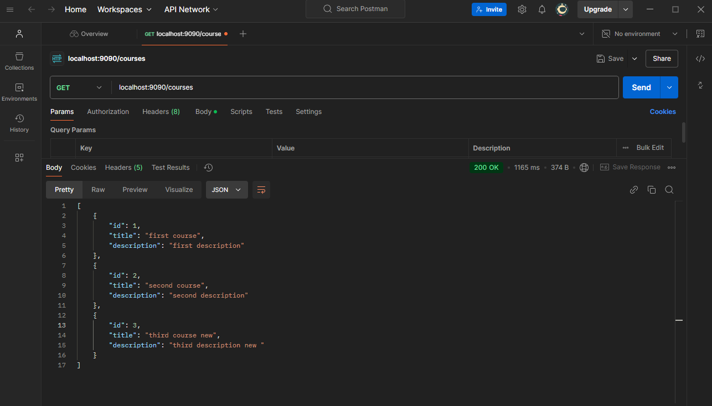

# RESTful API for Courses

This repository contains a RESTful API for managing a list of courses, allowing users to perform basic CRUD (Create, Read, Update, Delete) operations. The project is built with **Spring Boot** and is designed for simplicity and scalability.

---

## Features

- Add a new course to the database.
- Retrieve details of all courses or a specific course by ID.
- Update existing course details.
- Delete a course by ID.
- In-memory database for quick setup and testing.

---
## Screenshot






## Prerequisites

To run this project, ensure you have:

- **Java Development Kit (JDK)** 17 or higher.
- **Maven** (build tool) installed.
- **Git** for cloning the repository.

---

## Getting Started

### Clone the Repository
```bash
git clone https://github.com/arunsunhera/Java-REST-API.git
cd Java-REST-API
```

### Build and Run
1. Build the project using Maven:
   ```bash
   mvn clean install
   ```
2. Run the application:
   ```bash
   mvn spring-boot:run
   ```
3. The application will start at:
   ```
   http://localhost:8080/courses
   ```

---

## API Endpoints

### Base URL
`http://localhost:8080/courses`

| HTTP Method | Endpoint         | Description                    | Request Body        |
|-------------|------------------|--------------------------------|---------------------|
| GET         | `/`              | Get all courses                | -                   |
| GET         | `/{id}`          | Get course by ID               | -                   |
| POST        | `/`              | Add a new course               | `{ "id": "..." }`   |
| PUT         | `/{id}`          | Update an existing course      | `{ "id": "..." }`   |
| DELETE      | `/{id}`          | Delete a course by ID          | -                   |

---

## Sample JSON

Here is a sample JSON request body for creating or updating a course:

```json
{
  "id": 23,
  "name": "Spring Framework Basics"
  "description": "spring framework"
}
```

---

## Author
Arun Sunhera

## Connect with Me
- [LinkedIn](https://www.linkedin.com/in/arunsunhera)


